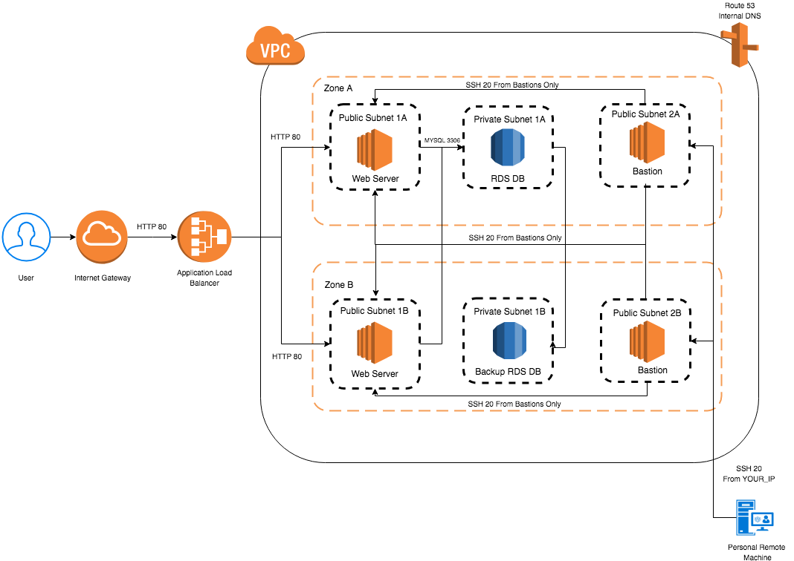

#### Launch Infrastructure

* Clone the the repo - `git clone url`
* Create a file called `terraform.tfvars` and add your AWS access key and secret key for your proper IAM user like so:

```
access_key = "YOUR_ACCESS_KEY"
secret_key = "YOUR_SECRET_KEY"
region     = "us-east-1"
dns_zone = "otto.internal"
vpc_cidr_block = "10.0.0.0/16"
permit_key = "YOUR SSH KEY NAME"
db_instance_class = "db.t2.micro"
webserver_instance_type = "t2.micro"
public_subnet_server_a_cidr = "10.0.1.0/24"
public_subnet_server_b_cidr = "10.0.2.0/24" 
private_subnet_db_a_cidr = "10.0.3.0/24"
private_subnet_db_b_cidr = "10.0.4.0/24"
public_subnet_bastion_a_cidr = "10.0.5.0/24"
public_subnet_bastion_b_cidr = "10.0.6.0/24"

```

#### 3 Tier Cloud Infrastructure 





* Initialize Terraform - `terraform init`
* Run it = `./launch.sh`